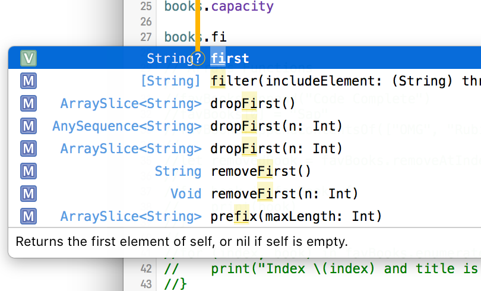

# Arrays

A list of elements with the **same type**.

### Definition

You can create an array specifying the type:
```Swift
var books: [String] = [
  "Clean Coder",
  "Swift: The Awesome Parts",
  "Javascript: The good Parts"
]
```

But also, you don't have to specify type and Swift Compiler will infere it.

```Swift
var animals = [
  "Lion",
  "Tiger",
  "Dolphin"
]

// Type of animals[] is String
```

### Properties (Some of them)

```Swift
books.first
books.count
```

### Properties can return nil values

Some methods and properties **can return nil values**.

How do you know when a method return nil? Whenever a **question mark** ? appears in the XCode Suggestion list, you know that it can returns a nil value.



So, when a variable can return nil values you have to assign (for example) the returned result to an optional variable (See the 'Optionals' Theory) and then check if the value is nil or not.

```Swift
if let myBook = books.first {
  print("The Book exists!")
  print(myBook)
}
else {
  print("The book is nil")
}
```

### Methods (Some of them)

```Swift
books[0] = "The Cleaner Code"
books.append("Design Patterns")

// Adding another list
books.appendContentsOf([
    "Another Book 1",
    "Another Book 2"
])

let removedBook = books.removeAtIndex(books.count - 1)
```

### Arrays Vs. Tuples

In a tuple, each element can have different types.
In an array, you can only put one type (Eg: array of Strings, array of Integers, etc...)


=============================
[<- Return Index](/README.md)
